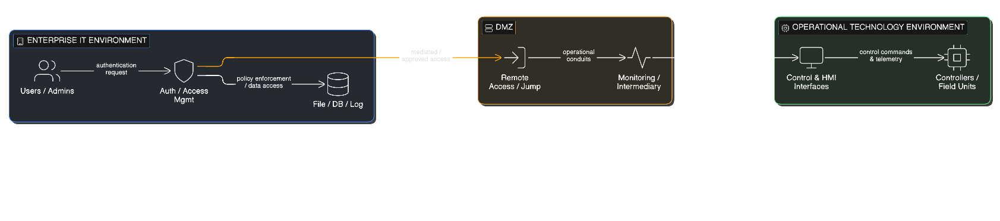

## Conceptual System Architecture

The following figure presents a high-level conceptual architecture of
the modeled critical infrastructure environment. The diagram abstracts
enterprise IT, intermediary zones, and operational technology (OT)
domains, highlighting **trust boundaries and dependency relationships**
rather than network-level configurations or implementation details.

---

## Trust Boundary Model

The following figure illustrates the trust-boundary model used in this research. It emphasizes different forms of trust—identity, data, and operational trust—and the implicit assumptions that arise at their intersections. The model highlights how adversary behavior often exploits **assumed trust relationships** rather than explicit access paths.

