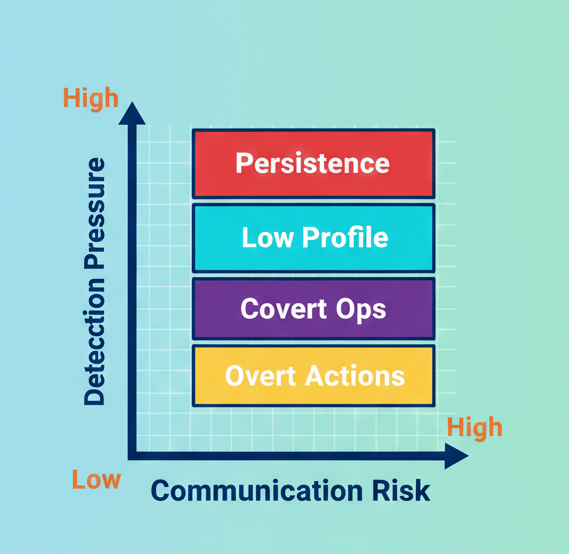
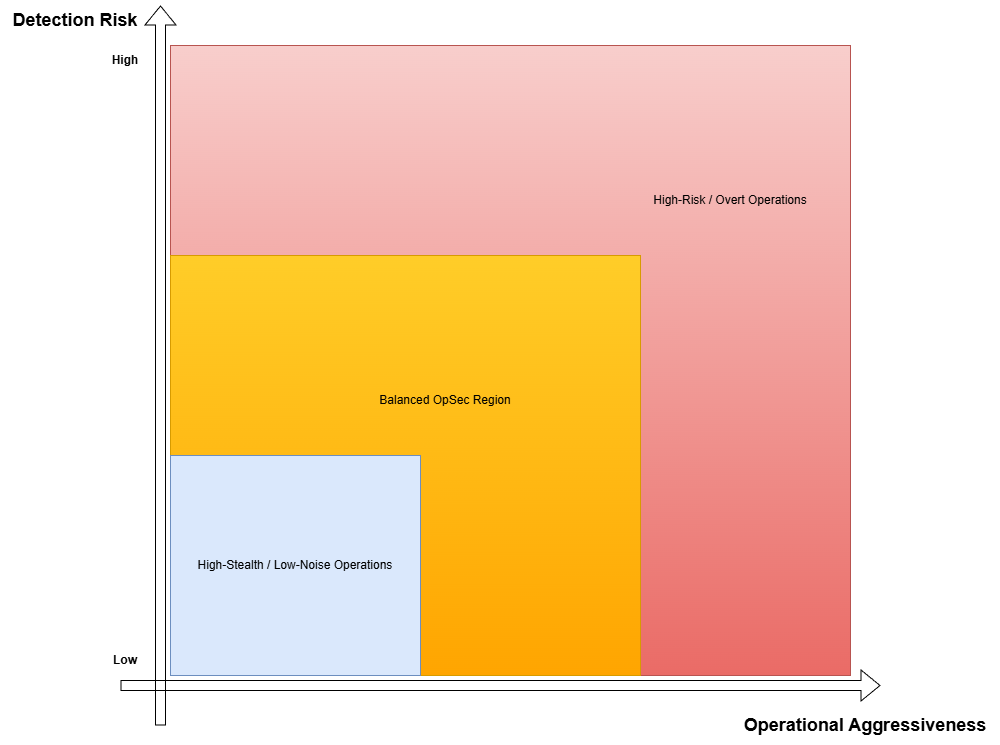

## Operational Security (OpSec) Influence

The following figure illustrates the role of operational security
(OpSec) as a decision-influencing factor throughout the adversary
lifecycle. Rather than a binary property, OpSec is modeled as a
**trade-off space** involving detection pressure, communication risk,
and persistence objectives.

## OpSec Trade-off Analysis

The following conceptual graph illustrates the trade-off between
operational aggressiveness and detection risk in adversary behavior.
The figure supports analytical reasoning about OpSec decisions and does
not represent empirical measurements.

